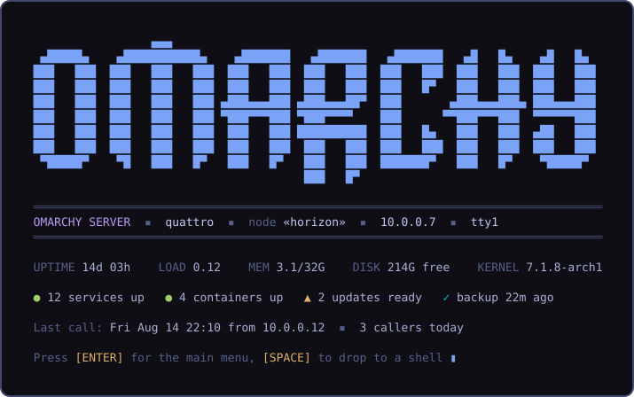
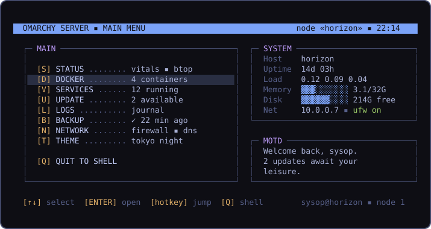
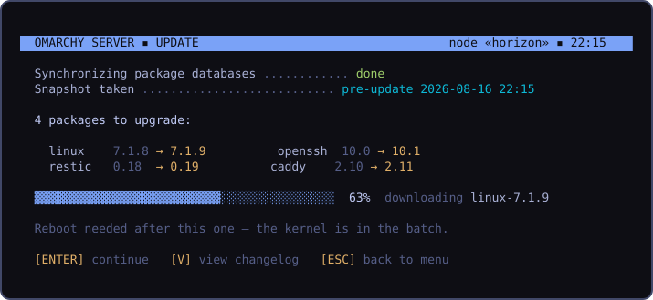

# Plan: Omarchy Server — a headless edition with a BBS front door

Revision 1.

## Problem

Omarchy's taste — opinionated defaults, a curated TUI toolbox, one-command updates with snapshots, themes everywhere — stops at the desktop. There is no story for the second machine most Omarchy users have: the home-lab box, the VPS, the closet server running Docker. Ubuntu has Server; Arch has a wiki and an afternoon of yak-shaving. People who want "Omarchy for servers" today either drag the entire Hyprland/GUI stack onto a headless machine or hand-strip it and lose the update pipeline.

And every server distro greets you the same dreary way: `Last login: ...` and a blinking cursor. A machine you *dial into* deserves a front door with character. Omarchy Server boots to a console, runs over SSH, and greets an interactive login like an old-school BBS: ANSI wordmark, node status, callers today, and a hotkey home menu that opens into the TUIs Omarchy already ships. The aesthetic isn't decoration bolted on — terminal-first is the whole product, so the terminal experience *is* the identity.

## Shape

A second edition built from this same repo — not a fork, not a mode toggle:

- No Hyprland, no Quickshell, no GUI packages. Boots to a getty on the console; SSH is the primary access and is on from first boot (key-only).
- A curated server package set: the existing CLI (`omarchy ...`), the TUI toolbox (btop, lazygit, lazydocker, lazyjournal), Docker + compose, ufw, snapper snapshots, the same update/migration pipeline. The backup plan (`plans/backup.md`) applies minus the shell panel; the dots plan (`plans/dots.md`) gets its best use case — syncing your configs between desktop and server.
- The BBS layer: a themed pre-login `/etc/issue`, a login splash, and a home menu (`omarchy-server-menu`) that works like a BBS door system — pick an entry, the tool takes the full screen, quitting it drops you back at the menu. `[Q]` is always a real shell.

## Rejected approaches

- **A fork repo**: permanent drift; every bin/ fix would need double maintenance. The dots plan's reasoning against wrapping third-party tools applies to wrapping ourselves.
- **A web admin panel** (Cockpit and friends): a second attack surface listening on a port, a second UI toolkit to theme, and not Omarchy's soul. The terminal is the product; SSH is the transport we already secured.
- **"Server mode" toggle on an installed desktop**: uninstalling a GUI stack in place is a migration minefield in both directions. Edition is chosen at install time; changing your mind is a reinstall (dots + backup make that cheap).
- **A compiled TUI framework** (bubbletea, ratatui) for the menu: a new toolchain for v1's needs. The repo's idiom is bash + gum, which is already themeable and already everywhere; revisit only if the menu outgrows it.
- **archinstall server profile**: Omarchy has its own installer and offline mirror; the edition is a package-set and provisioning variant of that pipeline, not a different installer.

## What it looks like

Mockups, generated from the repo's own `logo.txt` wordmark and the tokyo-night `colors.toml` — every theme restyles all three screens.

The login splash — pre-menu, both on the console and over SSH:

The home menu — hotkeys on the left, live vitals and MOTD on the right; every entry opens an existing Omarchy TUI or command as a full-screen "door" and returns here on exit:

A door in action — `[U]` runs the standard `omarchy-update` pipeline, snapshot first, in BBS dress:

## Design

### Edition mechanics

- The installer writes the edition (e.g. `/etc/omarchy-edition`), read by a new `omarchy-edition` helper with quiet predicates in the `hw-` tradition (`omarchy-edition-server`, exit-code interface) so scripts and migrations can gate.
- `install/omarchy-server.packages` is a hand-curated subset of `omarchy-base.packages` — subtraction, not a parallel list that drifts: keep the CLI, TUIs, docker, networking, security, and theming plumbing; drop compositor, shell, GUI apps, audio/bluetooth/printing stacks, fonts beyond the console.
- Migrations and refresh commands that touch GUI surfaces gate on edition; everything else (pacman, snapper, CLI, themes' terminal side) runs identically. One update pipeline, two editions.

### First boot

The existing provisioning flow, server flavor: hostname, user, then straight into `omarchy-setup-security-sshd --gh-keys <user>` (the unattended path already exists), ufw enabled with rate-limited SSH, password authentication off, optional Tailscale, optional static IP. The machine is reachable and safe before the first login greeting ever renders.

### The BBS front door

- **Pre-login**: a themed `/etc/issue` — compact logo, hostname, IP — so even the getty says who's answering.
- **Greeting**: interactive login shells (tty or ssh-with-pty only — never scp/sftp/rsync/exec sessions, never non-interactive shells, never inside tmux attach) run the splash: wordmark, edition/host/node line, vitals, service/container/update/backup counts, last call and callers today (from wtmp), then ENTER for the menu or any other key for a shell. `omarchy server greet <splash|menu|off>` sets whether login lands on the splash, jumps straight to the menu, or skips it all — per-user state, instant to change, and the greeting must never block a slow machine's login (vitals gather with a hard timeout; the menu renders with stale counts rather than making you wait).
- **Menu**: `omarchy-server-menu`, bash + gum. Entries route to what already exists — Status → btop, Docker → lazydocker, Services → a gum-driven systemctl list, Update → `omarchy-update`, Logs → lazyjournal, Backup → the backup plan's CLI status/actions, Network → ufw + interface status, Theme → `omarchy-theme-set`, Quit → shell. The menu is a launcher with a status pane, not a reimplementation of any tool.
- **Flavor, tasteful and default-on**: node number (session count), callers today, sysop framing, MOTD from `~/.config/omarchy/motd`. All output degrades to ASCII-and-16-colors when `TERM=linux` or the terminal can't do better; the art never breaks a dumb terminal.

### Theming

`themes/*/colors.toml` already defines everything the three screens need. A small bridge renders a theme into ANSI/truecolor escape palettes consumed by the splash, menu, and issue file; `omarchy-theme-set` on server applies the terminal-side targets it already knows (btop, starship, bat) plus the BBS palette. Switching themes restyles the whole front door — the mockups above are just tokyo-night.

### Relationship to the other plans

- **backup**: same engine, CLI, timer, and state file; the panel's job is done by the menu's Backup entry and the splash's status line. The plan's systemd user units run fine in a lingering or logged-in server session; server enables lingering so timers fire without an interactive login.
- **dots**: push your desktop's configs, pull them on the server — the multi-machine sync design's second machine is exactly this box.

## Rollout

- Phase 1 (this repo): `omarchy-edition` + predicates, `install/omarchy-server.packages`, edition gating in migrations/refresh commands, `omarchy-server-menu` + greeting + issue generation, theme bridge, `server` group in `GROUP_DESCRIPTIONS`.
- Phase 2 (coordinated): ISO/installer work in the ISO pipeline repo — a Server choice at install (or a separate slim ISO; open question), provisioning flow, offline mirror subset.
- Docs: a manual section for Omarchy Server (install, first boot, the menu, greet settings, headless conventions); `docs/` reference for edition gating so future migrations know the rule.
- Tests: greeting guards are the safety-critical bit — shell.d tests that non-interactive shells, scp/sftp, and `ssh host command` never see the menu; menu routing smoke tests; edition-predicate tests; CLI metadata via `omarchy commands --check`. Visual checks of splash/menu on a real console and over ssh per the visual-verification skill's spirit, adapted to a VM TTY.

## Open questions

1. One ISO with a Server install type vs a separate slim server ISO — the offline mirror for the desktop edition is large, and a server ISO could be a fraction of it.
2. Default server software beyond Docker: ship a web server (caddy) and let Install > Service grow server entries, or keep the base truly minimal and make everything opt-in?
3. Whether the splash-vs-menu-vs-off default should differ for console vs SSH logins (console boxes are often headless appliances; SSH is where the BBS lands).
4. Console glyph strategy on `TERM=linux`: ship a PSF console font with box-drawing coverage, or lean entirely on the ASCII fallback?
5. Does the desktop edition get the menu as `omarchy bbs` — an easter egg that doubles as the demo?
6. Naming: "Omarchy Server" is the descriptor; is there appetite for a BBS-flavored brand on the greeting itself ("Omarchy BBS — est. 2025"), or does that overcook it?
